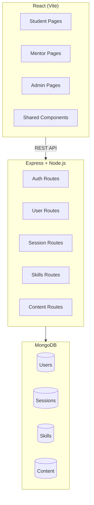

# Student Mentorship Platform — MERN Stack Implementation Plan

A full-stack web application connecting **students** with **mentors** for scheduled video sessions, skill tracking, and offline content — built with **MongoDB, Express, React, Node.js**.

---

## Architecture Overview



---

## Tech Stack

| Layer | Technology |
|-------|-----------|
| Frontend | React 18 (Vite), React Router, Axios, CSS Modules |
| Backend | Node.js, Express.js, Mongoose |
| Database | MongoDB Atlas (or local) |
| Auth | JWT (jsonwebtoken + bcryptjs) |
| Video | Embedded video player (YouTube/Vimeo links or uploaded URLs) |
| File upload | Multer (for video/content uploads) |

---

## Data Models

### User

```js
{
  name: String,
  email: String,          // unique
  password: String,       // hashed
  role: "student" | "mentor" | "admin",
  skills: [{ name: String, level: String }],
  bio: String,
  avatar: String,
  createdAt: Date
}
```

### Session

```js
{
  mentor: ObjectId → User,
  student: ObjectId → User,
  date: Date,
  timeSlot: { start: String, end: String },
  status: "pending" | "completed" | "cancelled",
  sessionLink: String,      // unique shareable link
  videoUrl: String,          // meeting / recording URL
  review: { rating: Number, comment: String },
  createdAt: Date
}
```

### Skill

```js
{
  name: String,
  category: String,
  users: [{ userId: ObjectId, role: String, level: String }]
}
```

### Content (Offline)

```js
{
  title: String,
  description: String,
  videoUrl: String,
  uploadedBy: ObjectId → User,
  createdAt: Date
}
```

---

## Project Structure

```
student mentorship/
├── client/                    # React frontend
│   ├── public/
│   ├── src/
│   │   ├── assets/
│   │   ├── components/        # Shared UI components
│   │   │   ├── Navbar.jsx
│   │   │   ├── Sidebar.jsx
│   │   │   ├── SessionCard.jsx
│   │   │   ├── SkillBadge.jsx
│   │   │   ├── VideoPlayer.jsx
│   │   │   └── ProtectedRoute.jsx
│   │   ├── pages/
│   │   │   ├── auth/
│   │   │   │   ├── Login.jsx
│   │   │   │   └── Register.jsx
│   │   │   ├── student/
│   │   │   │   ├── StudentProfile.jsx
│   │   │   │   └── StudentDashboard.jsx
│   │   │   ├── mentor/
│   │   │   │   ├── MentorProfile.jsx
│   │   │   │   └── MentorDashboard.jsx
│   │   │   ├── session/
│   │   │   │   ├── SessionPage.jsx
│   │   │   │   ├── SessionDetails.jsx
│   │   │   │   └── JoinSession.jsx    # accessed via shared link
│   │   │   ├── skills/
│   │   │   │   └── SkillsDashboard.jsx
│   │   │   └── admin/
│   │   │       ├── AdminDashboard.jsx
│   │   │       ├── SessionManagement.jsx
│   │   │       └── ContentManagement.jsx
│   │   ├── context/
│   │   │   └── AuthContext.jsx
│   │   ├── services/          # Axios API helpers
│   │   │   ├── authService.js
│   │   │   ├── sessionService.js
│   │   │   ├── userService.js
│   │   │   ├── skillService.js
│   │   │   └── contentService.js
│   │   ├── App.jsx
│   │   ├── App.css
│   │   └── main.jsx
│   ├── index.html
│   ├── vite.config.js
│   └── package.json
│
├── server/                    # Express backend
│   ├── config/
│   │   └── db.js
│   ├── middleware/
│   │   ├── auth.js            # JWT verify
│   │   └── roleCheck.js       # role-based access
│   ├── models/
│   │   ├── User.js
│   │   ├── Session.js
│   │   ├── Skill.js
│   │   └── Content.js
│   ├── routes/
│   │   ├── authRoutes.js
│   │   ├── userRoutes.js
│   │   ├── sessionRoutes.js
│   │   ├── skillRoutes.js
│   │   └── contentRoutes.js
│   ├── controllers/
│   │   ├── authController.js
│   │   ├── userController.js
│   │   ├── sessionController.js
│   │   ├── skillController.js
│   │   └── contentController.js
│   ├── utils/
│   │   └── generateLink.js
│   ├── server.js
│   └── package.json
│
├── .env
└── README.md
```

---

## API Endpoints

### Auth
| Method | Route | Description |
|--------|-------|-------------|
| POST | `/api/auth/register` | Register (student/mentor) |
| POST | `/api/auth/login` | Login, returns JWT |
| GET | `/api/auth/me` | Get current user |

### Users
| Method | Route | Description |
|--------|-------|-------------|
| GET | `/api/users/:id` | Get user profile |
| PUT | `/api/users/:id` | Update profile |
| GET | `/api/users?role=mentor` | List mentors |
| GET | `/api/users?role=student` | List students |

### Sessions
| Method | Route | Description |
|--------|-------|-------------|
| POST | `/api/sessions` | Create session (admin/mentor) |
| GET | `/api/sessions` | List sessions (filtered by user) |
| GET | `/api/sessions/:id` | Session details |
| PUT | `/api/sessions/:id` | Update status / add review |
| GET | `/api/sessions/link/:linkId` | Access session via shareable link |

### Skills
| Method | Route | Description |
|--------|-------|-------------|
| GET | `/api/skills` | All skills |
| POST | `/api/skills` | Add skill |
| GET | `/api/skills/match` | Match students ↔ mentors by skill |

### Content (Offline)
| Method | Route | Description |
|--------|-------|-------------|
| GET | `/api/content` | List all content |
| POST | `/api/content` | Upload content (admin) |
| PUT | `/api/content/:id` | Update content |
| DELETE | `/api/content/:id` | Delete content |

---

## Page-by-Page Feature Breakdown

### 1. Auth Pages
- **Login** — email/password form → JWT stored in localStorage
- **Register** — name, email, password, role selector (Student / Mentor)

### 2. Student Profile Page
- Personal details: name, email, skills, join date
- Activity tab: reviews given, previous sessions list with status badges

### 3. Mentor Profile Page
- Mirrors student profile structure
- Additional: available time slots, total sessions conducted

### 4. Session Page
- **Scheduling**: Mentor → Student (P1→P2) time slot picker
- **Session list**: cards showing date, participants, status pill (`Pending` / `Completed`)
- **Session detail**: video embed, review form

### 5. Join Session (via shareable link)
- Public route `/session/join/:linkId`
- Validates link, shows embedded video player + session info

### 6. Skills Dashboard
- Student skills tracking with progress indicators
- Mentor skills directory (searchable)
- **Search/Match**: find mentors matching a student's desired skills

### 7. Admin Dashboard
- **Session Management**: create sessions, assign mentor ↔ student, generate & copy shareable link
- **Content Management**: add/edit/delete offline video links with title & description

---

## Implementation Phases

### Phase 1 — Foundation (Backend core + Auth)
1. Initialize `server/` with Express, Mongoose, dotenv, cors
2. Create MongoDB models (`User`, `Session`, `Skill`, `Content`)
3. Implement auth routes (register, login, JWT middleware)
4. Implement role-based middleware

### Phase 2 — Backend API
5. User CRUD routes + controllers
6. Session CRUD + shareable link generation (`uuid` or `nanoid`)
7. Skills CRUD + match endpoint
8. Content CRUD + optional Multer upload

### Phase 3 — Frontend Foundation
9. Initialize `client/` with Vite + React
10. Set up React Router, AuthContext, ProtectedRoute
11. Build shared components (Navbar, Sidebar, SessionCard, SkillBadge, VideoPlayer)
12. Build Login & Register pages

### Phase 4 — Frontend Pages
13. Student Profile + Dashboard
14. Mentor Profile + Dashboard
15. Session Page (list + details + scheduling)
16. JoinSession page (shareable link access with video)
17. Skills Dashboard (tracking, directory, search/match)

### Phase 5 — Admin Panel
18. Admin Dashboard layout
19. Session Management (create, link generation, copy-to-clipboard)
20. Content Management (video link CRUD)

### Phase 6 — Polish & Verification
21. Responsive design pass
22. Error handling & loading states
23. End-to-end manual testing

---

## Verification Plan

### Automated (during development)
- **Server startup**: `cd server && npm run dev` — confirm "MongoDB connected" and "Server running on port 5000"
- **API smoke tests**: use the browser subagent to hit key endpoints via the running dev server

### Browser Testing
After both client and server are running:
1. **Register** a student, a mentor, and an admin → verify redirects and JWT storage
2. **Login** with each role → verify correct dashboard renders
3. **Create a session** from admin panel → verify it appears in session list
4. **Generate link** → copy and open in new tab → verify JoinSession page loads with video
5. **Skills page** → add skills, search for a mentor by skill → verify match results
6. **Content page** (admin) → add a video link → verify it appears in list

### Manual Verification (by user)
- Confirm MongoDB Atlas / local MongoDB connection string works
- Verify video URLs play correctly in the embedded player
- Test responsive layout on mobile viewport

> [!IMPORTANT]
> You will need a **MongoDB connection string** before starting. Please confirm whether you want to use **MongoDB Atlas** (cloud) or a **local MongoDB** instance, and provide the connection URI (or I can use a placeholder `mongodb://localhost:27017/mentorship`).

---

## Key Design Decisions

1. **JWT Auth** over session-based — simpler for SPA, stateless backend
2. **Video via URL embed** (not WebRTC) — the spec says "a video" on session link click, so we embed a provided URL (YouTube, Vimeo, or direct MP4) rather than building real-time video calling
3. **Shareable session links** use `nanoid` for short, unique, URL-safe IDs
4. **Role-based routing** — React Router + ProtectedRoute checks role from AuthContext
5. **No real-time features** in v1 — sessions are scheduled and accessed asynchronously
